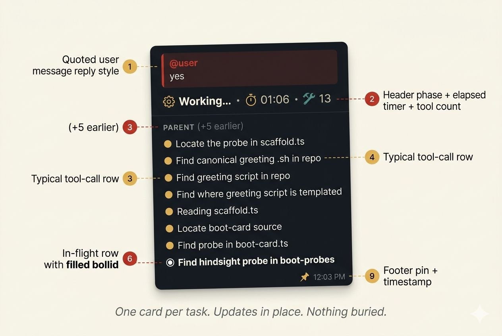
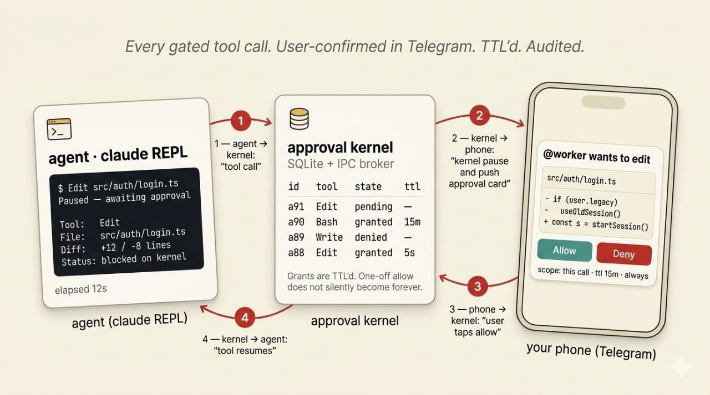
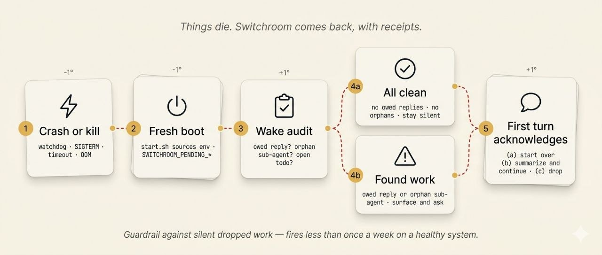

<p align="center">
  
</p>

# Switchroom

[](https://buildkite.com/ken-thompson/switchroom)
[](https://buildkite.com/ken-thompson/switchroom)
[](https://buildkite.com/ken-thompson/switchroom)
[](https://buildkite.com/ken-thompson/switchroom)

**A switchboard for your Pro or Max.** Your Claude subscription, as a fleet of always-on specialist agents you talk to from Telegram. Opinionated UX, done properly.

> *I loved OpenClaw + Telegram. I wanted my Claude subscription. And the UX done properly. So I built this.*

[Latest release notes →](CHANGELOG.md)

## See what your agent is doing

Every time an agent starts work, a **progress card** pins into its Telegram topic and updates in place as tools execute. Each Read, Bash, Edit, Grep is visible as it happens, with elapsed time so you can tell if something's stuck. Sub-agents surface in the same card. When the agent finishes, the card flips to Done and unpins.

No silent gaps. No ghosts. No squinting into a black box.

<p align="center"></p>

```
⚙️ Working… · ⏱ 12s
💬 refactor the auth module to use JWT
  ─ ─ ─
  … (+3 more earlier steps)
  ✅ Read src/auth/session.ts
  ✅ Grep "cookie" (in src/)
  🤖 Edit src/auth/jwt.ts · 4s
```

The card is the headline UX. The rest of the product is in service of it.

- Cards update at most once every 5 seconds. Fast enough to follow, not so fast it floods.
- Last 5 steps stay visible. Older ones collapse into `(+N more earlier steps)`.
- Running steps show elapsed time so a stuck tool is obvious.
- Tool labels are deterministic, written by a `PreToolUse` hook, so the card never lies about what's running.
- Two agents working at once? Each gets its own card, labelled `(1/2)` and `(2/2)`.

### Sub-agent visibility

When an agent delegates to a sub-agent — Opus plans, Sonnet implements — the sub-agent's work shows up indented inside the parent's pinned card. One pinned surface per task, however many processes it spawns underneath. Nothing gets buried in a side-channel you have to go look for.

### Right, so what's this about

So you had the bright idea. Run Claude Code agents 24/7 on a cheap Linux box, talk to them from Telegram, use the Claude Pro or Max subscription you're already paying for. Sensible. Obvious, even.

Then you tried OpenClaw. Followed the docs, spun it up, got it running, only to realise halfway through that you're pinging the Anthropic API on your own key and your token bill is quietly ticking over in the background. Bit of a bait and switch, that one. You signed up for "use your subscription," not "buy API credits on top of your subscription."

So you gave Claude Code's built-in Telegram channel a crack instead. Sent a message. Waited. Something happened, maybe. Eventually a reply came back. What did the agent actually do? No idea. Which tools ran? No idea. Did it get stuck, crash, spawn a sub-agent, read half your repo? No idea. It's an MVP black box of death, and I got sick of squinting into it.

So I built this.

## What you get

| Feature | What it does |
|---|---|
| **Progress cards** | Pinned, in-place, every tool call visible. The headline UX. |
| **Claude Pro/Max auth** | OAuth, not API keys. No per-token billing. Multi-account fallback pool per agent. |
| **Approval kernel** | Inline allow/deny cards in Telegram for every gated tool. TTL'd grants, full audit trail. |
| **Sub-agents** | Opus plans, Sonnet implements. Sub-agent work surfaces in the parent card. |
| **Config cascade** | Defaults, then profiles, then per-agent YAML. Change one line, every agent updates. |
| **Scheduled tasks** | Cron-syntax tasks that fire across reboots. Headless secret access via the vault broker. |
| **Persistent memory** | Hindsight semantic memory with knowledge graphs and mental models. |
| **Session continuity** | Resume across restarts with freshness gating and a wake-audit. |
| **Encrypted vault** | AES-256-GCM for secrets. Optional auto-unlock keyed off `/etc/machine-id`. |
| **Drive MCP** | Read Google Docs, Sheets, and Drive files inline. Per-agent OAuth, no shared key. |
| **Card audit log** | Every progress-card edit appended to `card-events.jsonl` for retrospective debugging. |
| **15 Telegram MCP tools** | Reply, stream replies, edit, pin, react, native checklists, sticker aliases, voice-in transcription, attachments, history. |

## Architecture

One long-running service per agent. Each agent runs the stock `claude` CLI — not a fork, not the Agents SDK, not a wrapped harness — authenticated directly with Anthropic via official OAuth. Switchroom is scaffolding and lifecycle around the CLI you'd run by hand: a Telegram bot, an approval broker, a vault broker, and Docker Compose for supervision. See [`docs/architecture.md`](docs/architecture.md) for the process model and how each layer maps to the `claude` CLI.

```
You (Telegram)
    │
    ▼
@YourBot ──┬── switchroom-telegram MCP ──┬── agent supervisor ─── Claude Code CLI
           │       (15 tools)            │     (per-agent)        │
           │                             │                        ├─ .claude/agents/*.md (sub-agents)
           ├─ Progress cards             ├─ Approval kernel ◄─────┤   settings.json (tools, hooks, MCP)
           ├─ Pin / unpin lifecycle      │   (allow/deny broker)  ├─ Hindsight plugin (memory)
           ├─ SQLite history             ├─ Vault broker ◄────────┤   Drive MCP, Playwright MCP, …
           ├─ Card-events.jsonl audit    │   (cron secrets, IPC)  └─ scheduled tasks across reboots
           ├─ Emoji reactions            │
           └─ Format conversion          └─ Docker Compose restart (unless-stopped)
```

See [`docs/architecture.md`](docs/architecture.md) for the process model, IPC layout, supervisor choice, and how each layer maps to the `claude` CLI.

## Approvals & safety

Tools that touch the world — Bash, Edit, Write, anything not on an agent's pre-approved allowlist — pause for explicit approval. Switchroom's **approval kernel** (shipped in v0.5.1) routes every gated tool call through an inline Telegram card with the actual diff or command shown. Tap Allow and the tool resumes. Tap Deny and the agent gets a clean refusal it can recover from.

<p align="center"></p>

- **Inline cards.** Allow / Deny / Allow once / Allow for 1h. No leaving Telegram.
- **TTL'd grants.** "Allow Bash for 1h" expires automatically. No silent permanent escalation.
- **Audit trail.** Every grant, denial, and expiry written to a per-agent log you can replay.
- **Per-agent allowlist.** `switchroom agent grant <name> <tool>` for the boring ones you don't want to be asked about.

The kernel runs as an out-of-process broker over a unix socket. The agent process never decides its own permissions; it asks and waits.

### Compliance posture

Switchroom never intercepts auth, never proxies inference, never patches the CLI. The `claude` binary you run is the one Anthropic ships. See the [Compliance Attestation](docs/compliance-attestation.md) for the full analysis against Anthropic's April 2026 third-party policy.

## Survives real life

Each agent is a long-running service. They survive reboots, network drops, and your laptop closing. But "always on" isn't enough on its own. Things still die. The product has to handle that gracefully or the illusion breaks.

<p align="center"></p>

- **Auto-restart.** Agent containers come up with `restart: unless-stopped`, and each service has a healthcheck — a crashed or wedged agent is brought back automatically. No silent dropped work.
- **Resume protocol.** When an agent reboots mid-turn, `start.sh` exports `SWITCHROOM_PENDING_TURN=true` plus the original chat / message ids. The agent's first action on boot is to acknowledge the gap and ask the user how to proceed (start over, summarise and continue, or drop it).
- **Wake-audit.** On every fresh boot the agent checks for owed replies, orphan sub-agents, and stale in-progress todos. If everything's clean it stays quiet. If it owed you a reply, it tells you.
- **Token refresh.** Runs unattended for weeks via a `refresh-tick` daemon. Multi-account fallback pool kicks in when the active slot hits its quota window.

## How it stacks up

| | Switchroom | Claude Code channels | OpenClaw | NanoClaw |
|---|---|---|---|---|
| Progress visibility | Live cards, pinned | Black box | None | None |
| Runtime | Claude Code CLI | Claude Code CLI | Custom runtime | Agents SDK |
| Auth | Pro/Max OAuth | Pro/Max OAuth | API key | API key |
| Sub-agent tracking | Yes, in card | No | No | No |
| Parallel task display | Labelled cards `(1/N)` | No | No | No |
| Approval UX | Inline Telegram cards | None | None | None |
| Config | YAML with cascade | None | JSON/TOML | Env vars |
| Setup | `switchroom setup` | Built-in (limited) | Docker compose | Docker compose |

The wedge against OpenClaw and NanoClaw isn't the substrate — it's the stock `claude` CLI under your subscription, instead of a custom runtime under your API key.

## Install

Runs on the box you already have. The supported production runtime is Linux + Docker (Ubuntu 24.04 LTS with 4GB RAM is the canonical target; other Linux distros work with minor tweaks). `switchroom apply` scaffolds every agent and writes a `docker-compose.yml` from your `switchroom.yaml`; you bring the fleet up yourself with `docker compose -p switchroom -f ~/.switchroom/compose/docker-compose.yml up -d`. Five published images on GHCR (`switchroom-base`, `switchroom-agent`, `switchroom-broker`, `switchroom-kernel`, `switchroom-scheduler`) — no `docker build` on the operator's host. macOS (Docker Desktop) works for development but is not yet release-validated.

> **Heads up on the package name.** The npm package was originally `switchroom-ai`. It's now just `switchroom`. The old name is deprecated and will stop receiving updates — `npm install -g switchroom` is the current path.

### From inside Claude Code (the on-ramp)

If you already use Claude Code, this is the shortest path. Inside any session:

```
/plugin marketplace add switchroom/switchroom
/plugin install switchroom@switchroom
/switchroom:setup
```

`/switchroom:setup` walks you through deps, `switchroom setup` (Telegram + vault + first agent), and `switchroom agent start`. Day-to-day: `/switchroom:start`, `/switchroom:stop`, `/switchroom:status`. See [`docs/publishing.md`](docs/publishing.md).

### One-liner (static binary)

```bash
curl -fsSL https://github.com/switchroom/switchroom/raw/main/install.sh | sh
```

Auto-detects your platform (linux / macos) and arch (amd64 / arm64), downloads the matching pre-built binary from the latest [GitHub release](https://github.com/switchroom/switchroom/releases/latest), verifies its SHA256, and drops it in `/usr/local/bin` (or `~/.local/bin` if not writable). Source is [`install.sh`](install.sh).

The static binary still needs the `claude` CLI to run agents: `npm i -g @anthropic-ai/claude-code` (Node 20.11+).

**Manual install** if you'd rather not pipe to sh:

```bash
# Pick the artifact for your platform/arch from the latest release page
curl -fsSL -o switchroom https://github.com/switchroom/switchroom/releases/latest/download/switchroom-linux-amd64
chmod +x switchroom
sudo mv switchroom /usr/local/bin/
```

Replace `switchroom-linux-amd64` with `switchroom-linux-arm64`, `switchroom-macos-amd64`, or `switchroom-macos-arm64` as needed. Verify against `switchroom-checksums.txt` from the same release.

**macOS Gatekeeper note.** Releases are not yet Apple-code-signed. After installing on macOS you may need to clear the quarantine xattr so the binary will run: `xattr -d com.apple.quarantine /usr/local/bin/switchroom`. The `install.sh` one-liner handles this automatically.

**Mac (Sequoia+) one-time.** macOS 15 adds a second-stage notarization check that the `xattr` strip alone does not bypass — you may still see a Gatekeeper "cannot verify the developer" dialog the first time you run `switchroom`. `install.sh` attempts `sudo spctl --add /usr/local/bin/switchroom` automatically (best-effort, ignored if sudo isn't available). If the dialog still fires, run that `spctl --add` manually, or open System Settings → Privacy & Security → "Open Anyway" once.

Then:

```bash
switchroom setup                                        # interactive Telegram wiring
switchroom agent create coach --profile health-coach    # scaffold your first agent
switchroom auth login coach                             # link your Pro or Max session
switchroom apply                                        # write docker-compose.yml
docker compose -p switchroom -f ~/.switchroom/compose/docker-compose.yml up -d
```

After the last command you talk to the agent from Telegram. You don't touch the server again.

### Already have node?

```bash
npm install -g @anthropic-ai/claude-code switchroom
switchroom setup
```

Node 20.11+. `switchroom setup` is the interactive first-time wizard. Scaffolds config, handles Telegram wiring, sets up the vault.

### One-shot happy path (no wizard)

If you already have Telegram credentials in `~/.switchroom/switchroom.yaml`, skip `switchroom setup`. `agent create --profile` writes a minimal entry for you, and auth is scoped per-agent:

```bash
switchroom agent create coach --profile health-coach
switchroom auth login coach
switchroom apply && docker compose -p switchroom -f ~/.switchroom/compose/docker-compose.yml up -d
```

## Example configuration

```yaml
switchroom:
  version: 1

telegram:
  # Per-agent bot token (DM-only by default).
  bot_token: "vault:telegram-bot-token"

memory:
  backend: hindsight

defaults:
  model: claude-opus-4-7   # or claude-sonnet-4-6, claude-haiku-4-5
  tools: { allow: [all] }
  subagents:
    worker:
      description: "Implementation tasks"
      model: sonnet
      background: true
      isolation: worktree
  schedule:
    - cron: "0 8 * * 1-5"
      prompt: "Morning briefing"
  session:
    max_idle: 2h

agents:
  assistant:
    topic_name: "General"
    memory: { collection: general }

  coach:
    topic_name: "Coach"
    extends: advisor
    soul:
      name: Coach
```

See [docs/configuration.md](docs/configuration.md) for the full reference.

## Vault broker (cron secrets)

Scheduled tasks run headless inside the agent container, so they can't prompt for the vault passphrase. The vault broker is a long-running container (`switchroom-vault-broker`) that holds the vault decrypted in memory after a one-time interactive unlock. Cron tasks fetch the specific keys they declare via a per-agent unix socket. The passphrase never sits on disk.

**Declare per-cron secrets in `switchroom.yaml`:**

```yaml
agents:
  scout:
    schedule:
      - cron: "0 8 * * *"
        prompt: "Morning brief."
        secrets: [openai_api_key, polygon_api_key]   # only these may be read
```

`secrets: []` (the default) means the cron has no vault access.

**Bootstrap once per host:**

```bash
switchroom apply                        # writes broker into docker-compose.yml
docker compose -p switchroom -f ~/.switchroom/compose/docker-compose.yml up -d switchroom-vault-broker
switchroom vault broker unlock          # prompt for passphrase, primes broker
```

Or just run `switchroom vault get <key>` from a TTY. The broker offers to take the unlocked state with `[Y/n]` so you don't have to remember a separate unlock command.

**Identity model (v0.7+).** Path-as-identity. The broker binds one socket per agent at `/run/switchroom/broker/<agent>/sock` inside its own container, hosted via a per-agent named volume that's also mounted at `/run/switchroom/broker/` inside `agent-<agent>`. The agent name is parsed unspoofably from the bind path — see `src/vault/broker/peercred.ts:socketPathToAgent()`. A compromised agent cannot pose as another agent's cron because it only ever sees its own socket on its mount. ACL is bind-time, never wire-time.

The broker locks on `SIGTERM` (so a container restart zeros the in-memory state) and on demand via `switchroom vault broker lock`. Use `switchroom vault get <key> --no-broker` to bypass and prompt locally.

Vault file (post-v0.7.12) lives at `~/.switchroom/vault/vault.enc` — a directory, not a single file, so atomic rename can use the parent as the staging dir. See [docs/vault.md](docs/vault.md) for the layout rationale.

### Auto-unlock on boot (opt-in)

By default, the broker holds the unlocked state in memory only. Every restart (host reboot, service crash, reconcile that re-renders the unit) wipes it and requires `switchroom vault broker unlock` again. For unattended hosts where this is too painful, switchroom can encrypt the passphrase with a key derived from `/etc/machine-id` and have the broker unlock itself at boot:

```bash
switchroom vault broker enable-auto-unlock   # one-time setup, prompts for passphrase
```

Done. The wizard prompts for your vault passphrase, encrypts it with AES-256-GCM keyed off `/etc/machine-id`, writes the result to `~/.switchroom/vault-auto-unlock` (mode 0600), flips `vault.broker.autoUnlock: true` in `switchroom.yaml`, restarts the broker, and verifies the vault came up unlocked. Every subsequent boot the broker reads + decrypts + unlocks itself.

Disable with `switchroom vault broker disable-auto-unlock`.

**Security tradeoff. Read this before enabling.** The encrypted blob lives at mode 0600 in your home directory; the encryption key is derived from `/etc/machine-id` plus a per-file random salt. Disk theft is safe (the blob doesn't decrypt on any other machine) and other UNIX users on the same box can't read it. But root on the host *can* read both the blob and the machine-id, so once root is on the machine the passphrase is recoverable. Same blast radius as the running broker process (anything with code-exec as you can already attach to the broker socket and exfiltrate secrets), but it shifts the convenience-vs-security knob: auto-unlock means a lost laptop is a lost vault even if the vault file itself is encrypted at rest. Use only on hosts you trust. See [docs/auto-unlock.md](docs/auto-unlock.md) for the full threat model and recovery instructions.

## CLI reference

```bash
switchroom setup                              # Interactive wizard
switchroom doctor                             # Health check
switchroom apply                              # Reconcile + (re)write docker-compose.yml; bring fleet up via `docker compose ... up -d`
switchroom restart [agent] [--force]          # Bounce agent(s); drains in-flight turn by default
switchroom version                            # Show versions + running agent health summary

switchroom agent list                         # Status of all agents
switchroom agent status <name>                # Status of one agent
switchroom agent add [name]                   # Wizard: scaffold a new agent end-to-end (#543)
switchroom agent create <name> [--profile <p>] # Scaffold + install timers; --profile writes yaml entry
switchroom agent bootstrap <name> --profile <p> --bot-token <t>  # One-shot scaffold + auth + start
switchroom agent reconcile <name|all>         # Re-apply switchroom.yaml (without pulling/building)
switchroom agent start|stop|restart <name>    # Lifecycle (with preflight)
switchroom agent interrupt <name>             # Cancel in-flight turn without restarting
switchroom agent rename <old> <new>           # Rename an agent slug (#168)
switchroom agent destroy <name>               # Remove from compose + scaffold dir
switchroom agent attach <name>                # Interactive tmux session
switchroom agent logs <name> [-f]             # View logs
switchroom agent grant <name> <tool>          # Grant a tool permission
switchroom agent permissions <name>           # Show allow/deny list
switchroom agent dangerous <name> [off]       # Toggle full tool access
```

Profiles live in `profiles/` at the repo root. Bundled ones for `--profile`: `coding`, `default`, `executive-assistant`, `health-coach` (the `_base/` dir is framework-internal render templates and is not a user-selectable profile).

`switchroom agent create <name> --profile <profile>` does two things in one step:

1. Adds an entry to `switchroom.yaml` under `agents:` with `extends: <profile>` and a derived `topic_name` (capitalized agent name). Edit the yaml afterwards to change the topic name, emoji, tools, etc.
2. Scaffolds the agent directory and registers the agent in `docker-compose.yml` on next `switchroom apply` (same as running `agent create` on an entry that already exists in yaml).

If the agent is already in yaml, `--profile` must match the existing `extends:` value or it errors. If the yaml entry has no `extends:` and you pass `--profile`, the flag is written in additively with a warning. Running `agent create` with no `--profile` on a missing entry keeps the old "Agent not defined in switchroom.yaml" error, now with a hint to use `--profile`.

Model aliases: the bare names `opus`, `sonnet`, `haiku` are accepted alongside the full IDs (`claude-opus-4-7`, `claude-sonnet-4-6`, `claude-haiku-4-5`). Use whichever reads cleaner in your config.

### Authentication (multi-account slot pool)

Each agent has a pool of Claude OAuth slots. The **active** slot is what the agent uses; other slots are automatic fallbacks when the active slot hits its quota window. Every `<slot>` option defaults to the active slot if omitted.

```bash
switchroom auth status                            # All agents, one table
switchroom auth login <agent>                     # First-time OAuth into the active slot
switchroom auth code <agent> <browser-code>       # Paste the code back from the browser
switchroom auth cancel <agent>                    # Abandon a pending login
switchroom auth reauth <agent> [--slot <s>]       # Fresh OAuth, replace existing token
switchroom auth refresh <agent>                   # Alias for reauth (back-compat)
switchroom auth refresh-tick [--threshold-ms N]   # Daemon: rotate tokens nearing expiry (cron/timer)

switchroom auth add <agent> [--slot <name>]       # Add another account to the fallback pool
switchroom auth use <agent> <slot>                # Switch the active slot
switchroom auth list <agent> [--json]             # Show slots: health, quota status, expiry
switchroom auth rm <agent> <slot> [--force]       # Remove a slot (refuses active/last slot)
```

The fallback pool also works from Telegram. The switchroom MCP plugin exposes the same verbs as `/auth add|use|list|rm` inside the chat.

### Workspace (agent bootstrap layer)

Each agent has a workspace directory (`~/.switchroom/agents/<name>/workspace/`) with editable stable files (`AGENTS.md`, `SOUL.md`, `USER.md`, `IDENTITY.md`, `TOOLS.md`) and dynamic files (`MEMORY.md`, `memory/YYYY-MM-DD.md`, `HEARTBEAT.md`) that are injected into the model's context at turn time.

```bash
switchroom workspace path <agent>                 # Print the workspace dir
switchroom workspace show <agent> [file]          # Print one workspace file (default AGENTS.md)
switchroom workspace edit <agent> [file]          # Open in $EDITOR (default AGENTS.md)
switchroom workspace render <agent> --stable      # Dump the stable bootstrap block (for start.sh)
switchroom workspace render <agent> --dynamic     # Dump the dynamic block (for UserPromptSubmit)
switchroom workspace search <agent> <query...>    # BM25-lite search over workspace markdown
switchroom workspace commit <agent> [-m <msg>]    # Git checkpoint of workspace state
switchroom workspace status <agent>               # git status on the workspace
```

### Observability

```bash
switchroom debug turn <agent>                     # Dump the exact prompt layering from the last turn
switchroom memory setup|search|stats|reflect      # Hindsight memory
```

The progress card driver also writes a per-agent `card-events.jsonl` audit log: every edit, pin, unpin, and tool-label transition the user sees in Telegram, captured locally so a debug session doesn't depend on Telegram's history. Tail it like any other journal.

### Other

```bash
switchroom topics sync|list|cleanup               # Telegram forum topics
switchroom vault init|set|get|list|remove         # Encrypted secrets
switchroom handoff <agent>                        # Cross-session handoff summarizer
switchroom web                                    # Web dashboard
```

### Migrating credentials from OpenClaw

`scripts/import-openclaw-credentials.ts` is a one-shot migration script that lifts `/data/openclaw-config/credentials/` into the Switchroom vault. It ships with a small set of default mappings for filenames OpenClaw documents out of the box.

User-specific credential filenames (your custom bot tokens, SSH keys, and so on) belong in a local overlay file, not the source repository. Create `~/.switchroom/import-openclaw.yaml`:

```yaml
# ~/.switchroom/import-openclaw.yaml
files:
  telegram-bot-token-mybot: telegram/mybot-bot-token
  discord-bot-token-mybot: discord/mybot-bot-token
  my-server-ssh-key: ssh/my-server
skip:
  compass-mac-cookies.json: "auto-managed by compass skill (8h TTL cache)"
secrets_env:
  X_BEARER_TOKEN: x-api/bearer-token
directories:
  garmin-tokens: garmin/tokens
```

Overlay entries win on collision with built-in defaults. Unknown files that appear in neither defaults nor the overlay surface as `warn` entries so nothing is silently dropped. Run `bun scripts/import-openclaw-credentials.ts --help` for flags including `--mapping <path>` to override the default overlay location.

## Documentation

| Guide | Description |
|---|---|
| **[Changelog](CHANGELOG.md)** | Release notes, every version |
| **[Configuration](docs/configuration.md)** | Full field reference, cascade semantics, profiles |
| **[Vault](docs/vault.md)** | Architecture, per-cron secrets, ACL, audit log, threat model |
| **[Telegram Plugin](docs/telegram-plugin.md)** | Progress cards, 15 MCP tools, native checklists, sticker aliases, voice-in |
| **[Sub-Agents](docs/sub-agents.md)** | Model routing, delegation patterns, frontmatter spec |
| **[Scheduling](docs/scheduling.md)** | Cron tasks (per-agent scheduler container), model selection |
| **[Session Management](docs/session-optimization.md)** | Continuity, compaction, freshness policy |
| **[OpenClaw alternative](docs/vs-openclaw.md)** | Switchroom vs OpenClaw |
| **[NanoClaw alternative](docs/vs-nanoclaw.md)** | Switchroom vs NanoClaw |
| **[Compliance](docs/compliance-attestation.md)** | Anthropic compliance analysis |
| **[Telemetry](docs/posthog.md)** | What Switchroom reports to PostHog and how to opt out |

## Telemetry

Switchroom reports anonymous usage events and errors to PostHog so I can spot regressions and understand which commands are used. **No personal data, code, or message content leaves your machine.** The anonymous ID lives at `~/.switchroom/analytics-id` and is a random UUID. Not tied to your username, email, IP, or machine identifier (we pass `disableGeoip: true` on every event).

To opt out, set this in your shell profile:

```bash
export SWITCHROOM_TELEMETRY_DISABLED=1
```

Full event catalogue, dashboard links, and the source module at [docs/posthog.md](docs/posthog.md).

## FAQ

**Can I use a Claude Pro or Max subscription instead of an API key?**
Yes. That's the whole point. Switchroom runs the unmodified `claude` CLI with the same OAuth flow you use on the desktop app. No API key. No per-token billing.

**How is this different from Claude Code's built-in Telegram channel?**
The built-in channel is message in, message out, with zero visibility into what the agent is doing in between. Switchroom adds live progress cards that pin to the top of each topic and update as tools execute. You can always see what's happening, which is the bit the built-in channel gets wrong.

**Does it work with multiple agents at the same time?**
Yes. Each agent gets its own Telegram forum topic. When multiple agents are working simultaneously, each has its own pinned progress card labelled `(1/N)`, `(2/N)` and so on.

**Can I see what sub-agents are doing?**
Yes. When an agent delegates to a sub-agent (a worker, a researcher), the sub-agent's activity shows up in its own indented section of the parent's progress card. You see the full hierarchy, not just the top-level agent.

**What does it cost to run?**
A cheap Linux VPS (around $6/mo on Hetzner, DigitalOcean, wherever), plus your existing Claude Pro ($20/mo) or Max ($100/mo) subscription. Switchroom itself is MIT-licensed, free.

**Is this against Anthropic's terms of service?**
No. Switchroom uses the official `claude` binary with the official OAuth flow. See [docs/compliance-attestation.md](docs/compliance-attestation.md) for the full analysis.

**Is Switchroom an alternative to OpenClaw?**
Yes. Same use case, but it uses your Claude subscription via OAuth instead of an API key, and runs the native `claude` binary instead of a custom runtime in Docker. See [vs-openclaw](docs/vs-openclaw.md).

## License

MIT. See [CONTRIBUTING.md](CONTRIBUTING.md).
